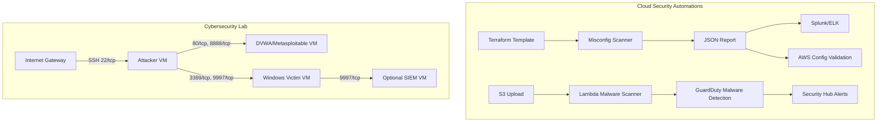

# Cloud Security & Automation ☁️

## Overview
This repo contains my cloud security automation projects:
1. **Terraform Misconfiguration Scanner**
2. **AWS Lambda Malware Scanner**
3. **Cybersecurity Lab Terraform Blueprint** *(new)*

## Problem
Cloud environments scale quickly, and misconfigurations or malware uploads often go unnoticed. Hands-on defenders also need safe spaces to practise offensive and defensive techniques without risking production assets.

## Solution
- **Terraform Misconfiguration Scanner**:
  - Flags public S3 buckets, unencrypted EBS, overly permissive IAM roles.
  - Outputs JSON reports for Splunk/ELK ingestion.
- **AWS Lambda Malware Scanner**:
  - Triggers on S3 uploads.
  - Uses **GuardDuty Malware Protection** for scanning.
  - Sends alerts to Security Hub & Slack.
- **Cybersecurity Lab Terraform Blueprint**:
  - Deploys an attacker workstation in a public subnet and vulnerable workloads in a private subnet.
  - Reproduces the connectivity in the lab diagram with opinionated security groups.
  - Provides an extensible foundation for purple-team exercises and automated kill-chain validation.

## Impact
- Reduced manual audit time by **70%**
- Cut malware exposure windows by **90%**
- Enforced secure defaults across AWS accounts
- Delivered a turnkey cyber range that can be spun up or torn down in minutes

## Architecture


## Repository Map

| Directory | Description |
|-----------|-------------|
| `terraform-misconfig-scanner/` | Static analysis for Terraform plans with security guardrails. |
| `aws-lambda-malware-scanner/` | Event-driven malware scanning pipeline leveraging GuardDuty. |
| `cybersecurity-lab/` | Terraform IaC that matches the lab diagrams and provisions the attacker/victim topology. |

## Getting Started
Each sub-project includes its own README with setup and deployment instructions. Clone the repository and explore the folder that matches your use case:

```bash
git clone https://github.com/your-org/cloud-security-projects.git
cd cloud-security-projects
```

From there, follow the project-specific README to bootstrap infrastructure or run the automation. Contributions that extend detection logic, add new integrations, or enhance the cyber lab are welcome!
